# 📘 Manual de Usuario  
## Sistema Web Empresarial Full-Stack

---

## 🏫 Centro Universitario del Norte - CUNOR

**Nombre:** Edward Rene Winter Tiu  
**Carné:** 202140469  
**Proyecto:** Sistema Web Empresarial Full-Stack  
**Documento:** Manual de Usuario  

---

# 📑 Índice

1. [Introducción](#-1-introducción)  
2. [Objetivo del Manual](#-2-objetivo-del-manual)  
3. [Descripción General del Sistema](#-3-descripción-general-del-sistema)  
4. [Roles del Sistema](#-4-roles-del-sistema)  
5. [Acceso al Sistema](#-5-acceso-al-sistema)  
6. [Inicio de Sesión](#-6-inicio-de-sesión)  
7. [Ingreso como Administrador](#-7-ingreso-como-administrador)  
8. [Ingreso como Interno](#-8-ingreso-como-interno)  
9. [Ingreso como Cliente](#-9-ingreso-como-cliente)  
10. [Panel Principal](#-10-panel-principal)  
11. [Módulo de Usuarios](#-11-módulo-de-usuarios)  
12. [Módulo de Clientes](#-12-módulo-de-clientes)  
13. [Módulo de Proyectos](#-13-módulo-de-proyectos)  
14. [Módulo de Tareas](#-14-módulo-de-tareas)  
15. [Módulo de Reportes](#-15-módulo-de-reportes)  
16. [Módulo de Historial](#-16-módulo-de-historial)  
17. [Permisos por Tipo de Usuario](#-17-permisos-por-tipo-de-usuario)  
18. [Recomendaciones de Uso](#-18-recomendaciones-de-uso)  
19. [Cierre de Sesión](#-19-cierre-de-sesión)  
20. [Conclusión](#-20-conclusión)  

---

# 📌 1. Introducción

El presente manual de usuario tiene como finalidad orientar al usuario en el uso correcto del **Sistema Web Empresarial Full-Stack**, una plataforma diseñada para administrar usuarios, clientes, proyectos, tareas, reportes e historial dentro de una empresa o institución.

Este sistema permite llevar un control organizado de los proyectos empresariales, asignar tareas, dar seguimiento al avance de cada actividad y consultar información importante de manera clara y estructurada.

La plataforma está diseñada para ser utilizada por diferentes tipos de usuarios, cada uno con permisos específicos de acuerdo con su función dentro del sistema.

---

# 🎯 2. Objetivo del Manual

El objetivo principal de este manual es explicar de forma clara y sencilla el funcionamiento del sistema, para que los usuarios puedan utilizar correctamente cada uno de los módulos disponibles.

Este manual permite:

- Conocer las funciones principales del sistema.
- Identificar los módulos disponibles.
- Comprender los permisos de cada tipo de usuario.
- Aprender a iniciar sesión correctamente.
- Utilizar las herramientas de administración, seguimiento y consulta.
- Evitar errores durante el uso de la plataforma.
- Facilitar el aprendizaje del sistema para nuevos usuarios.

---

# 🖥️ 3. Descripción General del Sistema

El **Sistema Web Empresarial Full-Stack** es una aplicación web desarrollada para gestionar procesos internos relacionados con proyectos empresariales.

La plataforma permite administrar:

- Usuarios del sistema.
- Clientes registrados.
- Proyectos empresariales.
- Tareas relacionadas con proyectos.
- Reportes del sistema.
- Historial de actividades.
- Información relacionada con el avance de los proyectos.

El sistema está dividido en diferentes módulos para facilitar su uso y mantener una estructura ordenada.

Cada módulo cumple una función específica y permite que la información sea administrada de forma eficiente.

---

# 👥 4. Roles del Sistema

El sistema cuenta con tres tipos principales de usuarios:

## 🔐 Administrador

El administrador tiene acceso completo al sistema. Puede gestionar usuarios, clientes, proyectos, tareas, reportes e historial.

Este usuario tiene los permisos más altos dentro de la plataforma.

## 👨‍💼 Interno

El usuario interno tiene acceso a la mayoría de funciones del sistema, pero no puede administrar el módulo de usuarios.

Este rol está pensado para personal interno de la empresa que necesita trabajar con proyectos, clientes, tareas y reportes, sin modificar usuarios del sistema.

## 👤 Cliente

El cliente tiene acceso limitado. Solo puede visualizar información relacionada con sus propios proyectos, tareas, informes e historial.

Este rol está diseñado para que el cliente pueda consultar el avance de sus proyectos sin tener acceso a información interna o administrativa.

---

# 🌐 5. Acceso al Sistema

Para acceder al sistema, el usuario debe ingresar a la dirección web correspondiente desde un navegador.

Se recomienda utilizar navegadores actualizados como:

- Google Chrome.
- Microsoft Edge.
- Mozilla Firefox.
- Brave.

Al ingresar al sistema, se mostrará la pantalla de inicio de sesión, donde el usuario deberá colocar sus credenciales para acceder.

---

# 🔑 6. Inicio de Sesión

La pantalla de inicio de sesión permite ingresar al sistema mediante credenciales previamente registradas.

El usuario debe completar los campos solicitados:

- Correo electrónico o usuario.
- Contraseña.

Luego debe presionar el botón de inicio de sesión para ingresar al sistema.

Si las credenciales son correctas, el sistema redirige al usuario al panel principal correspondiente a su rol.

Si las credenciales son incorrectas, el sistema puede mostrar un mensaje de error indicando que los datos ingresados no son válidos.

## 📸 Captura: Inicio de Sesión

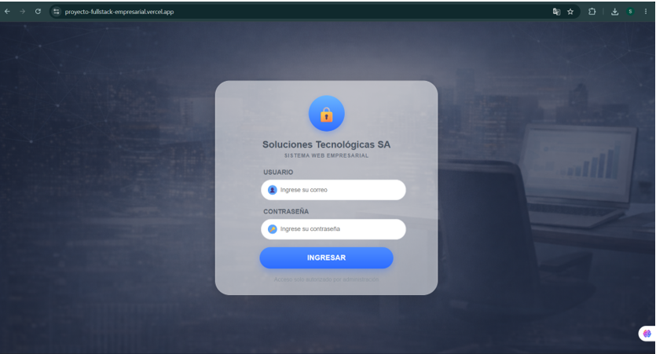

---

# 🔐 7. Ingreso como Administrador

El administrador es el usuario con mayor nivel de permisos dentro del sistema.

Al iniciar sesión como administrador, se habilitan todos los módulos disponibles en la plataforma.

## Funciones principales del administrador

El administrador puede:

- Registrar nuevos usuarios.
- Editar usuarios existentes.
- Eliminar usuarios.
- Administrar clientes.
- Crear proyectos.
- Editar proyectos.
- Eliminar proyectos.
- Asignar tareas.
- Consultar reportes.
- Revisar el historial del sistema.
- Gestionar información general de la plataforma.

## Pasos para ingresar como administrador

1. Abrir el sistema desde el navegador.
2. Ingresar el usuario o correo del administrador.
3. Ingresar la contraseña correspondiente.
4. Presionar el botón de inicio de sesión.
5. Verificar que se muestre el panel principal con todos los módulos habilitados.

## 📸 Captura: Inicio de Sesión como Administrador

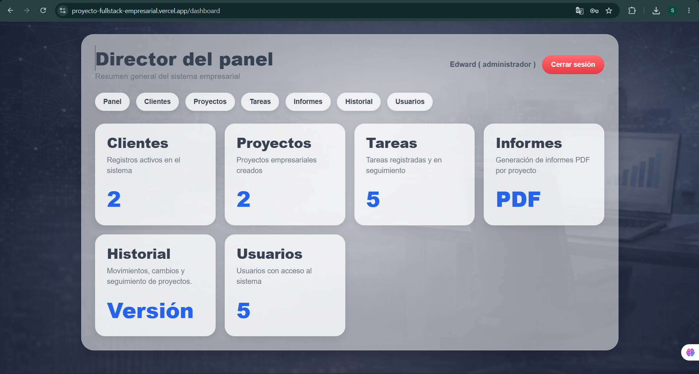

---

# 👨‍💼 8. Ingreso como Interno

El usuario interno tiene permisos similares al administrador, pero con una restricción importante: no tiene acceso al módulo de usuarios.

Esto permite que el personal interno pueda trabajar con proyectos, tareas, clientes y reportes sin modificar la administración principal de usuarios.

## Funciones disponibles para el usuario interno

El usuario interno puede:

- Ver clientes.
- Gestionar proyectos.
- Crear tareas.
- Editar tareas.
- Consultar reportes.
- Revisar historial.
- Dar seguimiento al avance de los proyectos.

## Restricción principal

El usuario interno no puede:

- Crear usuarios.
- Editar usuarios.
- Eliminar usuarios.
- Acceder al módulo de administración de usuarios.

## Pasos para ingresar como interno

1. Abrir el sistema desde el navegador.
2. Ingresar el usuario o correo del interno.
3. Ingresar la contraseña correspondiente.
4. Presionar el botón de inicio de sesión.
5. Verificar que el sistema muestre los módulos permitidos para el rol interno.

## 📸 Captura: Inicio de Sesión como Interno

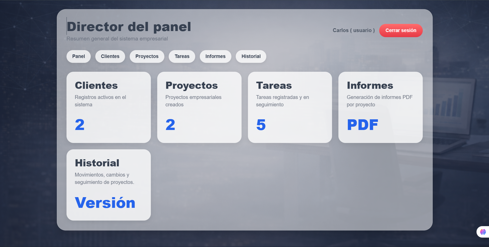

---

# 👤 9. Ingreso como Cliente

El cliente tiene acceso limitado al sistema. Su función principal es consultar información relacionada únicamente con sus propios proyectos.

El cliente no puede modificar información administrativa ni acceder a datos de otros clientes.

## Funciones disponibles para el cliente

El cliente puede:

- Ver sus proyectos.
- Consultar sus tareas.
- Revisar informes.
- Ver el historial relacionado con sus proyectos.

## Restricciones del cliente

El cliente no puede:

- Administrar usuarios.
- Ver información de otros clientes.
- Crear proyectos generales.
- Eliminar proyectos.
- Modificar datos administrativos.
- Acceder a módulos internos del sistema.

## Pasos para ingresar como cliente

1. Abrir el sistema desde el navegador.
2. Ingresar el usuario o correo del cliente.
3. Ingresar la contraseña correspondiente.
4. Presionar el botón de inicio de sesión.
5. Verificar que el sistema muestre únicamente la información permitida para el cliente.

## 📸 Captura: Inicio de Sesión como Cliente

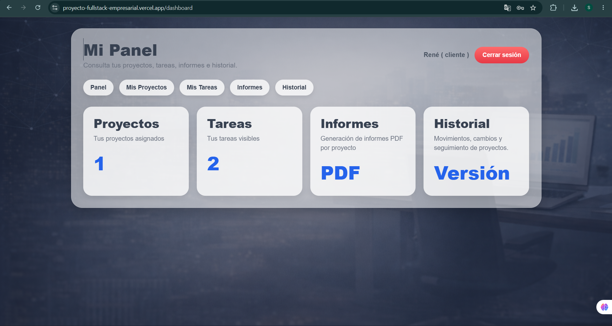

---

# 🏠 10. Panel Principal

Después de iniciar sesión correctamente, el sistema muestra el panel principal.

Desde este panel, el usuario puede acceder a los módulos disponibles según su rol.

El panel principal permite visualizar las opciones más importantes del sistema y navegar entre ellas de forma rápida.

## Elementos principales del panel

El panel puede incluir:

- Menú de navegación.
- Accesos a módulos.
- Información general del sistema.
- Opciones de usuario.
- Botón para cerrar sesión.

## Funcionamiento del panel

El panel principal funciona como el centro de navegación del sistema.

Desde aquí, el usuario puede seleccionar el módulo que desea utilizar.  
Los módulos visibles dependerán del tipo de usuario que haya iniciado sesión.

Por ejemplo:

- El administrador puede visualizar todos los módulos.
- El interno visualiza los módulos permitidos, excepto usuarios.
- El cliente visualiza únicamente la información relacionada con sus proyectos.

## 📸 Captura: Panel Principal

---

# 👥 11. Módulo de Usuarios

El módulo de usuarios está disponible únicamente para el administrador.

Este módulo permite gestionar las cuentas que tienen acceso al sistema.

## Funciones del módulo de usuarios

Desde este módulo se puede:

- Registrar nuevos usuarios.
- Consultar usuarios existentes.
- Editar información de usuarios.
- Cambiar roles o permisos.
- Eliminar usuarios cuando sea necesario.

## Crear un nuevo usuario

Para crear un usuario, el administrador debe:

1. Ingresar al módulo de usuarios.
2. Seleccionar la opción para agregar un nuevo usuario.
3. Completar los datos solicitados.
4. Asignar el rol correspondiente.
5. Guardar la información.

## Editar un usuario

Para editar un usuario:

1. Buscar el usuario en la lista.
2. Seleccionar la opción de edición.
3. Modificar los datos necesarios.
4. Guardar los cambios.

## Eliminar un usuario

Para eliminar un usuario:

1. Seleccionar el usuario correspondiente.
2. Presionar la opción de eliminar.
3. Confirmar la acción.

## Importancia del módulo de usuarios

Este módulo es importante porque permite controlar quién puede ingresar al sistema y qué acciones puede realizar cada usuario.

Por seguridad, solo el administrador debe tener acceso a esta sección.

## 📸 Captura: Módulo de Usuarios

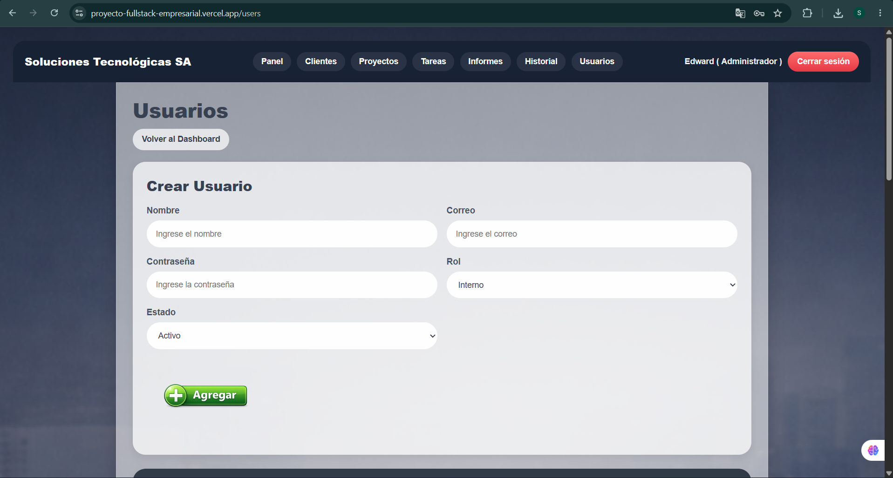

---

# 🧾 12. Módulo de Clientes

El módulo de clientes permite registrar y administrar la información de los clientes vinculados a los proyectos.

Este módulo ayuda a mantener un control ordenado de los clientes que participan en el sistema.

## Funciones del módulo de clientes

El usuario autorizado puede:

- Registrar clientes.
- Consultar clientes.
- Editar información de clientes.
- Eliminar clientes.
- Relacionar clientes con proyectos.

## Registrar un cliente

Para registrar un cliente:

1. Ingresar al módulo de clientes.
2. Seleccionar la opción de nuevo cliente.
3. Completar los datos solicitados.
4. Guardar el registro.

## Editar un cliente

Para editar un cliente:

1. Buscar el cliente dentro de la lista.
2. Seleccionar la opción de editar.
3. Modificar la información necesaria.
4. Guardar los cambios.

## Eliminar un cliente

Para eliminar un cliente:

1. Seleccionar el cliente.
2. Presionar el botón de eliminar.
3. Confirmar la eliminación.

## Importancia del módulo de clientes

El módulo de clientes permite mantener organizada la información de las personas o empresas relacionadas con los proyectos.

Esto facilita el seguimiento y la administración de los proyectos asignados a cada cliente.

## 📸 Captura: Módulo de Clientes

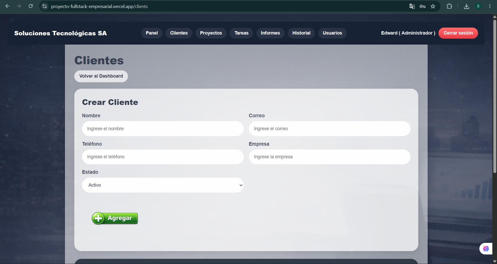

---

# 📁 13. Módulo de Proyectos

El módulo de proyectos permite administrar todos los proyectos registrados dentro del sistema.

Cada proyecto puede estar relacionado con un cliente y puede contener diferentes tareas para su seguimiento.

## Funciones del módulo de proyectos

Desde este módulo se puede:

- Crear proyectos.
- Consultar proyectos.
- Editar proyectos.
- Eliminar proyectos.
- Revisar el estado del proyecto.
- Consultar el avance general.
- Acceder a detalles del proyecto.

## Crear un nuevo proyecto

Para crear un proyecto:

1. Ingresar al módulo de proyectos.
2. Seleccionar la opción de nuevo proyecto.
3. Completar los datos requeridos.
4. Asignar el cliente correspondiente.
5. Definir el estado inicial del proyecto.
6. Guardar la información.

## Estados de un proyecto

Un proyecto puede tener estados como:

- Pendiente.
- En proceso.
- Avanzado.
- Finalizado.
- Completado.

El estado del proyecto puede cambiar según el avance de las tareas relacionadas.

## Editar un proyecto

Para editar un proyecto:

1. Buscar el proyecto en la lista.
2. Presionar la opción de editar.
3. Modificar los datos necesarios.
4. Guardar los cambios.

## Ver detalle de un proyecto

Para ver el detalle de un proyecto:

1. Ingresar al módulo de proyectos.
2. Buscar el proyecto.
3. Seleccionar la opción de ver detalle.
4. Revisar la información completa del proyecto.

## Importancia del módulo de proyectos

Este módulo permite llevar el control general de cada proyecto registrado en el sistema.

También ayuda a conocer el estado actual, el cliente relacionado y el avance de las tareas asociadas.

## 📸 Captura: Módulo de Proyectos

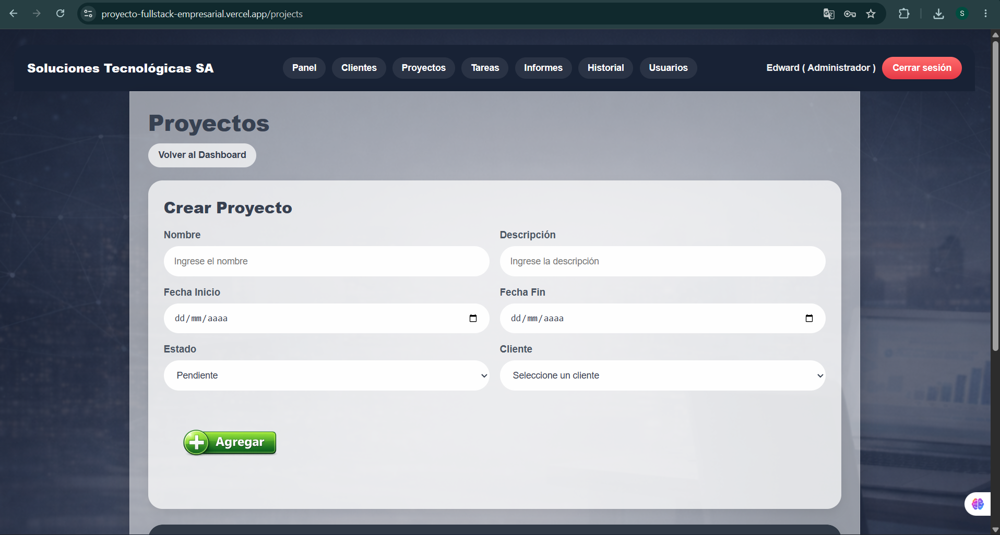

---

# ✅ 14. Módulo de Tareas

El módulo de tareas permite gestionar las actividades relacionadas con cada proyecto.

Cada tarea ayuda a medir el avance del proyecto y permite dar seguimiento a las responsabilidades asignadas.

## Funciones del módulo de tareas

Desde este módulo se puede:

- Crear tareas.
- Editar tareas.
- Eliminar tareas.
- Cambiar el estado de una tarea.
- Registrar avances.
- Asociar tareas a proyectos.
- Consultar tareas por proyecto.

## Crear una tarea

Para crear una tarea:

1. Ingresar al módulo de tareas.
2. Seleccionar la opción de nueva tarea.
3. Elegir el proyecto relacionado.
4. Completar el nombre o descripción de la tarea.
5. Definir el porcentaje o estado de avance.
6. Guardar la tarea.

## Estados de una tarea

Las tareas pueden manejar estados como:

- Pendiente.
- En proceso.
- Avanzada.
- Completada.

## Avance de tareas

Cuando se modifica el avance de una tarea, el sistema permite reflejar el progreso del proyecto.

Por ejemplo:

- Si una tarea está en 0%, se considera pendiente.
- Si una tarea avanza al 50%, el proyecto puede mostrarse en proceso.
- Si las tareas llegan al 100%, el proyecto puede mostrarse como finalizado o completado.

## Editar una tarea

Para editar una tarea:

1. Buscar la tarea en la lista.
2. Seleccionar la opción de editar.
3. Modificar los datos necesarios.
4. Guardar los cambios.

## Eliminar una tarea

Para eliminar una tarea:

1. Seleccionar la tarea correspondiente.
2. Presionar el botón de eliminar.
3. Confirmar la acción.

## Importancia del módulo de tareas

Este módulo permite controlar el trabajo realizado dentro de cada proyecto.

Además, permite conocer el avance de las actividades y facilita la actualización del estado general del proyecto.

## 📸 Captura: Módulo de Tareas

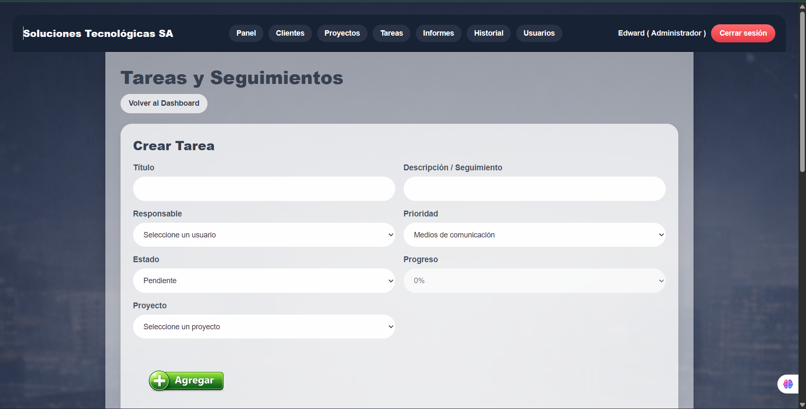

---

# 📊 15. Módulo de Reportes

El módulo de reportes permite generar información organizada sobre proyectos, tareas, clientes y avances.

Este módulo facilita la revisión de datos importantes para la toma de decisiones.

## Funciones del módulo de reportes

Desde este módulo se puede:

- Consultar reportes generales.
- Revisar avances de proyectos.
- Visualizar tareas asociadas.
- Generar informes.
- Exportar información cuando esté disponible.

## Reportes de proyectos

Los reportes de proyectos permiten visualizar:

- Nombre del proyecto.
- Cliente relacionado.
- Estado del proyecto.
- Porcentaje de avance.
- Tareas asociadas.
- Historial de cambios.

## Reportes de tareas

Los reportes de tareas pueden mostrar:

- Nombre de la tarea.
- Proyecto relacionado.
- Estado actual.
- Porcentaje de avance.
- Fecha de creación.
- Fecha de actualización.

## Importancia del módulo de reportes

Los reportes ayudan a tener una visión clara del estado de los proyectos.

También permiten revisar el avance de las tareas y obtener información útil para el seguimiento administrativo.

## 📸 Captura: Módulo de Reportes

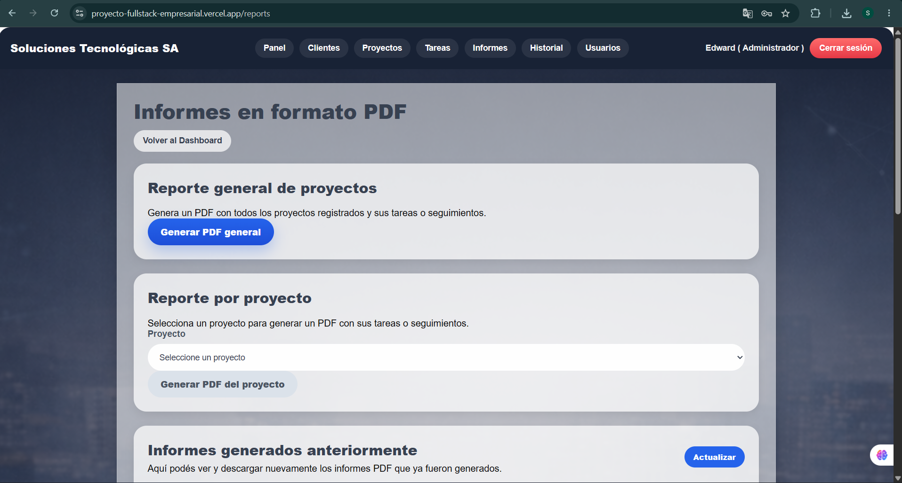

---

# 🕓 16. Módulo de Historial

El módulo de historial permite consultar las acciones realizadas dentro del sistema.

Este módulo es útil para revisar cambios, movimientos o registros relacionados con proyectos y tareas.

## Funciones del historial

El historial puede mostrar:

- Cambios realizados en proyectos.
- Cambios realizados en tareas.
- Usuarios que realizaron acciones.
- Fechas de modificación.
- Estados anteriores y nuevos.
- Seguimiento general del sistema.

## Uso del historial

Para consultar el historial:

1. Ingresar al módulo de historial.
2. Buscar el registro correspondiente.
3. Revisar la información mostrada.
4. Verificar los cambios realizados dentro del sistema.

## Importancia del módulo de historial

El historial permite mantener un registro de las acciones realizadas.

Esto ayuda a tener control sobre los cambios y facilita la revisión de actividades dentro de la plataforma.

## 📸 Captura: Módulo de Historial

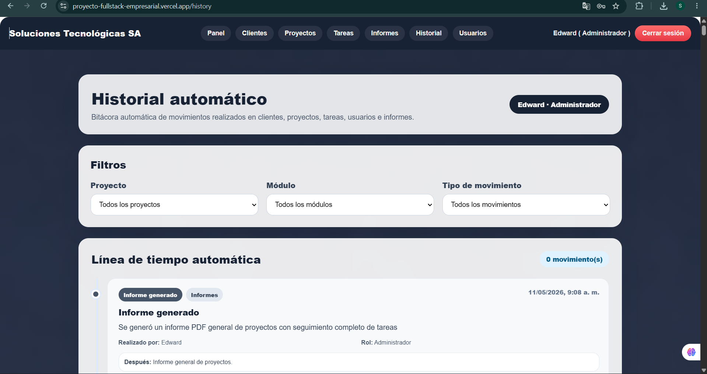

---

# 🔐 17. Permisos por Tipo de Usuario

A continuación, se describen los permisos principales de cada rol dentro del sistema.

| Módulo / Función | Administrador | Interno | Cliente |
|------------------|---------------|---------|---------|
| Iniciar sesión | ✅ | ✅ | ✅ |
| Ver panel principal | ✅ | ✅ | ✅ |
| Gestionar usuarios | ✅ | ❌ | ❌ |
| Ver usuarios | ✅ | ❌ | ❌ |
| Gestionar clientes | ✅ | ✅ | ❌ |
| Ver clientes | ✅ | ✅ | ❌ |
| Gestionar proyectos | ✅ | ✅ | ❌ |
| Ver proyectos propios | ✅ | ✅ | ✅ |
| Gestionar tareas | ✅ | ✅ | ❌ |
| Ver tareas propias | ✅ | ✅ | ✅ |
| Ver reportes | ✅ | ✅ | ✅ |
| Ver historial | ✅ | ✅ | ✅ |
| Cerrar sesión | ✅ | ✅ | ✅ |

## Descripción de permisos

El administrador tiene acceso completo a todo el sistema.

El interno puede trabajar con los módulos operativos, pero no puede administrar usuarios.

El cliente solo puede consultar información relacionada con sus propios proyectos, tareas, informes e historial.

---

# 🧭 18. Recomendaciones de Uso

Para utilizar correctamente el sistema, se recomienda:

- Ingresar con credenciales válidas.
- No compartir la contraseña con otros usuarios.
- Cerrar sesión al finalizar.
- Verificar la información antes de guardarla.
- Evitar eliminar registros sin confirmar que ya no son necesarios.
- Mantener actualizados los datos de clientes y proyectos.
- Registrar correctamente el avance de las tareas.
- Revisar los reportes para verificar el progreso de los proyectos.
- Usar navegadores actualizados para evitar errores de visualización.
- No utilizar cuentas de otros usuarios.
- Revisar los datos antes de confirmar acciones importantes.
- Mantener organizada la información registrada en cada módulo.

---

# 🚪 19. Cierre de Sesión

Para salir del sistema correctamente, el usuario debe utilizar la opción de cerrar sesión.

Esto ayuda a proteger la información y evita que otras personas puedan acceder sin autorización.

## Pasos para cerrar sesión

1. Ubicar la opción de cerrar sesión.
2. Presionar el botón correspondiente.
3. Confirmar la salida si el sistema lo solicita.
4. Verificar que se regrese a la pantalla de inicio de sesión.

## Importancia del cierre de sesión

Cerrar sesión correctamente ayuda a mantener la seguridad de la información.

Esto es especialmente importante cuando el sistema se utiliza en computadoras compartidas o públicas.

## 📸 Captura: Cierre de Sesión

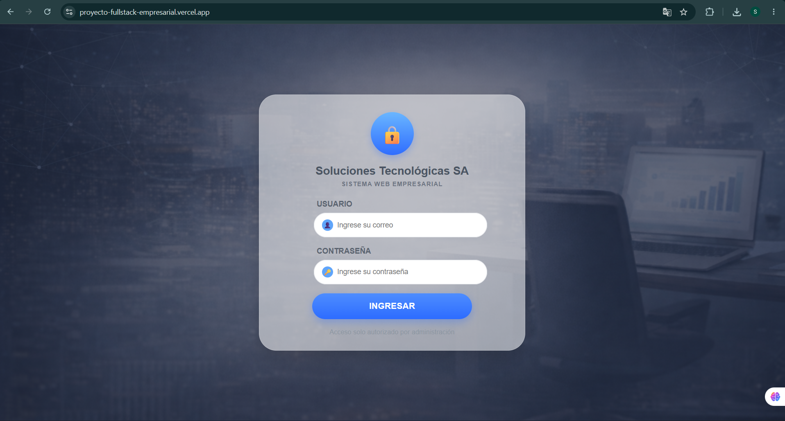

---

# 🧩 20. Conclusión

El **Sistema Web Empresarial Full-Stack** es una herramienta diseñada para facilitar la administración y seguimiento de proyectos empresariales.

A través de sus módulos, permite gestionar usuarios, clientes, proyectos, tareas, reportes e historial de manera ordenada y eficiente.

El uso correcto del sistema ayuda a mejorar el control interno, mantener la información organizada y facilitar la toma de decisiones.

Este manual sirve como guía para que los usuarios puedan comprender el funcionamiento del sistema y utilizar correctamente cada una de sus opciones.

---
